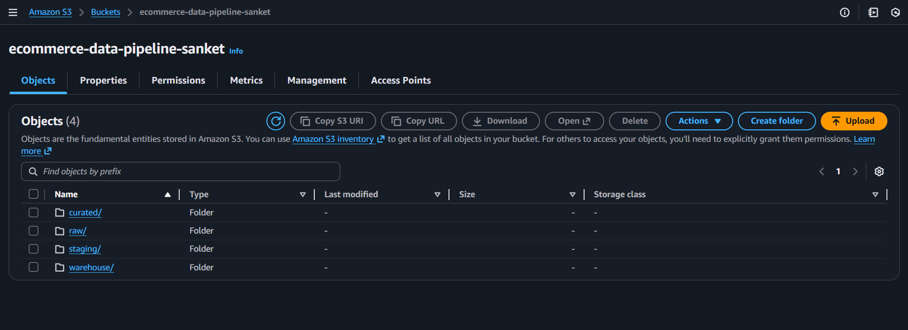
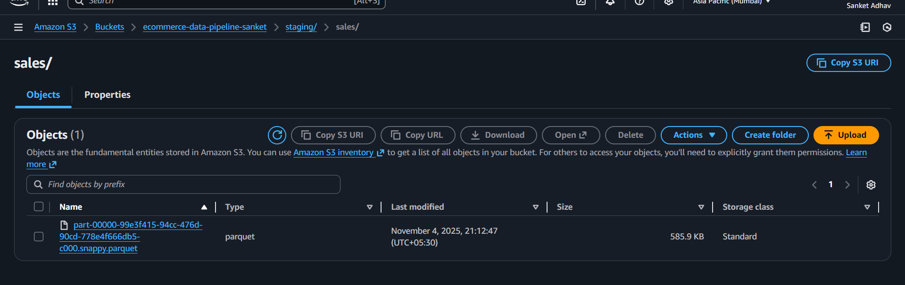
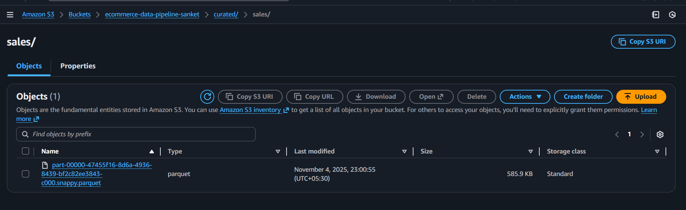
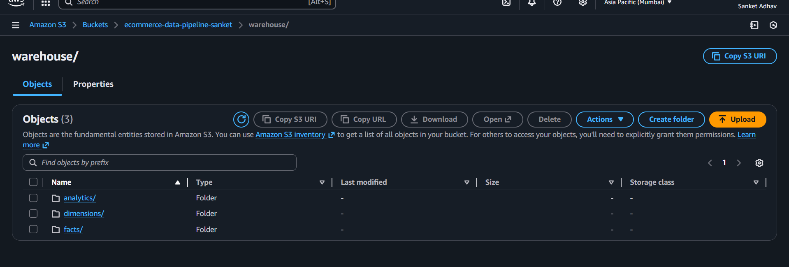

# 🚀 E-Commerce Data Engineering Pipeline (AWS Glue + Databricks + Power BI)

## 📖 Overview
This project showcases an **end-to-end Data Engineering pipeline** designed to extract raw e-commerce sales data from AWS S3, transform it using **AWS Glue (PySpark)**, model it into a **Star Schema** on **Databricks**, and visualize the insights in **Power BI**.

The goal is to demonstrate a real-world cloud-based data pipeline — from ingestion to analytics — while applying **incremental loading, data modeling, and optimization techniques**.

---

## 🧱 Architecture Diagram
The following architecture illustrates the data flow across different layers of the pipeline.


### **Pipeline Flow**
1. **Raw Layer:** CSV files uploaded to AWS S3.  
2. **Staging Layer:** AWS Glue PySpark jobs perform data cleaning and type conversion.  
3. **Curated Layer:** Stores incremental, clean, and validated Parquet data.  
4. **Warehouse Layer:** Databricks processes curated data into **Fact and Dimension tables (Star Schema)**.  
5. **Analytics Layer:** Data visualized in Power BI dashboards.

---

## 🧩 Data Modeling (Star Schema)
The data is structured using a **Star Schema** to enable efficient analytical queries.


### **Schema Details**
| Table | Description |
|--------|--------------|
| **fact_sales** | Transaction-level fact table containing metrics like Sales, Profit, Quantity, Discount |
| **dim_customer** | Customer attributes such as Name, Segment |
| **dim_product** | Product details including Category and Sub-Category |
| **dim_region** | Regional information such as Country, State, and City |
| **dim_date** | Time dimension (Year, Month, Day) for temporal analysis |

---

## 🗂️ AWS S3 Data Lake Structure

### 📁 Data Lake Overview


### 📂 Raw Zone


### 📂 Staging Zone


### 📂 Curated Zone


### 📂 Warehouse Zone


Each folder represents a **data zone** in the pipeline:  
- `raw/` → Ingested source data  
- `staging/` → Intermediate cleaned data from AWS Glue  
- `curated/` → Final transformed Parquet files  
- `warehouse/` → Fact and Dimension tables stored for analytics

---

## 📊 Power BI Dashboard
The final analytical dashboard was built using **Power BI** to visualize business KPIs.


### **Key Visuals**
- 💰 Total Sales & Profit KPIs  
- 🌎 Sales by Region and Category  
- 📅 Monthly Sales Trends  
- 🏆 Top 10 Products by Profit  

---

## ⚙️ Tech Stack
From [`Docs/tech_stack.txt`](Docs/tech_stack.txt):

```
AWS S3 – Data Lake Storage
AWS Glue (PySpark) – ETL Processing
Databricks – Data Modeling & Transformation
Power BI – Visualization & Reporting
Python, SQL, PySpark – Languages
Parquet – File Format
```

---

## 📄 Project Summary
📘 View the full project summary here:  
👉 [Docs/project_summary.pdf](Docs/project_summary.pdf)

---

## 🧠 Key Learnings
✅ Built a cloud-based end-to-end data pipeline  
✅ Implemented **incremental loading** in AWS Glue  
✅ Designed **star schema** in Databricks  
✅ Optimized data lake using Parquet format  
✅ Created interactive Power BI dashboard  

---

## 🏁 Outcome
A fully automated **E-Commerce Data Pipeline** capable of transforming raw sales data into business-ready insights, demonstrating hands-on expertise in:

- Data lake architecture  
- ETL and data modeling  
- Cloud data integration  
- BI dashboarding

---

## 🧑‍💻 Author
**👋 Sanket Aba Adhav**  
📫 [GitHub](https://github.com/sanket-521) | 💼 Aspiring Data Engineer

---

### 📁 Folder Reference
```
Docs/
│  ├── project_summary.pdf
│  ├── schema_design.png
│  └── tech_stack.txt

Screenshots/
│  ├── architecture_diagram.png
│  ├── s3_overview.png
│  ├── s3_raw.png
│  ├── s3_staging.png
│  ├── s3_curated.png
│  ├── s3_warehouse.png
│  └── PowerBI Dashboard.png

notebooks/
│  ├── 01_data_cleaning_glue.py
│  ├── 02_incremental_load_glue.py
│  ├── 03_fact_dim_databricks.ipynb
│  └── 04_analytics_view.ipynb
```

---
